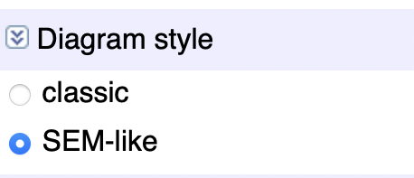

```{r setup, include = FALSE}
library(knitr)
library(tidyverse)
# set default options
#pts_chunk$set(echo = FALSE,
              # fig.width = 7.252,
               #fig.height = 4,
               #dpi = 300)

```

class: title-slide, top

# Directed Acyclic Graph (DAG)

The DAG published on [Dagitty](http://dagitty.net/dags.html?id=UDvDOn) aims to identify possible confounders of **Employment status** and **viral load/adherence** relationship.

To facilitate its view, I recommend changing the potion Diagram Style from classic to SEM- like.
```{r echo = FALSE, out.height="20%", fig.height=1, out.width="20%", fig.align='left'}

```

A DAG must be drawn based on knowledge; for that reason, your inputs are relevant to get the correct one.
Important points:
- Arrows imply a relationship between the two variables connected; the flow is unidirectional and temporal.
- The absence of an arrow means no relationship at all. So, in case of doubt, it is better to establish a connection, since this connection does not indicate its directions or signs (e.g. positive o negative relationship, strong or weak one)
- DAG should contain all important variables, even those unmeasured. The unmeasured variables are presented as an elliptic node.
.charite[.right[press the space key to move]]
---
class: title-slide, top

# Focal relationship
- Outcome: Viral load (**VL**)
- Exposure: Employment Status (**EmpS**)

<br>

## Covariates
.pull-left[
- **Comr**: comorbidities
- **Edu**: Education Level
- **MigSt**: Migratory Status
- **HealthI**: Health insurance
- **SPI**: Social priority Index, according to “comuna”
- **PillsB**: Pills burden
]
.pull-right[
- **ARVTy**: Antiretroviral type
- **STR**: Single tablet regimen
- **TimeOn**: Time on ART
- **Adh**: Adherence to pharmacy claims, the proxy of ART adherence.
- **Addic**: Addictions
- **Homel**: Homelessness
]


